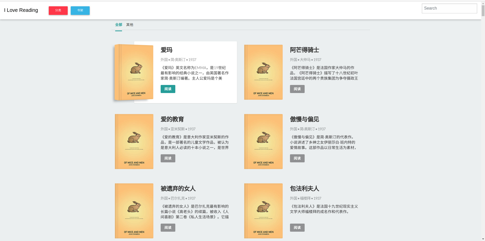

# books

# centos mysql安装
1. yum -y install mysql mysql-server mysql-devel
2. rpm -qi mysql-server
3. service mysqld start
4. create user apple@'%' identified by 'apple';
5. GRANT ALL PRIVILEGES ON `%`.* TO 'apple'@'%' IDENTIFIED BY 'apple' WITH GRANT OPTION;
   GRANT ALL PRIVILEGES ON `%`.* TO 'apple'@'localhost' IDENTIFIED BY 'apple' WITH GRANT OPTION;
6. flush privileges;
7. /etc/init.d/iptables stop

# Nginx
1. sudo yum install epel-release
2. yum --enablerepo=epel install nginx
3. /etc/init.d/nginx start

# Nginx ssl
通过certbot申请
